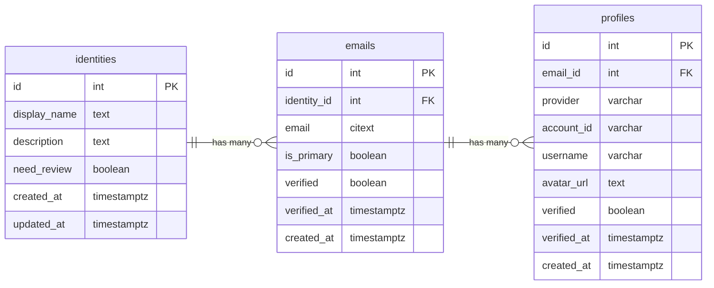

# How to combine user tables into a single identity system for Boost website

## Goal

Create a centralized system to store and manage Boost community members. This system will aggregate user data from GitHub, WG21 papers, mailing lists, and other social media platforms. It will support user subscriptions, notification preferences, segmentation by industry verticals and C++ versions, user profiles, contribution tracking, and targeted communications. The system integrates with the website-v2 project.

## Current state

The Boost website-v2 uses multiple separate user and email tables across different Django apps. This split-up data causes several problems.

### 1. Multiple user-related tables exist

| App/Module        | Models                              | Notes                           |
| ----------------- | ----------------------------------- | ------------------------------- |
| Django (built-in) | `EmailAddress`, `SocialAccount`     | Django provided                 |
| users             | `User`                              | Main user table in this project |
| libraries         | `CommitAuthor`, `CommitAuthorEmail` |                                 |
| slack             | `SlackUser`                         |                                 |

### 2. Inconsistent foreign key references

Different models reference to different user tables, making things complicated:

| Model                       | Field            | References              |
| --------------------------- | ---------------- | ----------------------- |
| `libraries.Commit`          | `author`         | `CommitAuthor`          |
| `libraries.Library`         | `authors`        | `users.User` (M2M)      |
| `libraries.LibraryVersion`  | `maintainers`    | `users.User` (M2M)      |
| `libraries.LibraryVersion`  | `authors`        | `users.User` (M2M)      |
| `mailing_list.EmailData`    | `author`         | `CommitAuthor`          |
| `marketing.CapturedEmail`   | `email`          | String (no FK)          |
| `news.Entry`                | `author`         | `users.User`            |
| `news.Entry`                | `moderator`      | `users.User`            |
| `slack.SlackActivityBucket` | `user`           | `SlackUser`             |
| `versions.Review`           | `submitters`     | `CommitAuthor` (M2M)    |
| `versions.Review`           | `review_manager` | `CommitAuthor`          |
| `libraries.CommitAuthor`    | `user`           | `users.User` (nullable) |

### 3. Problems with current approach

User data is split up across multiple tables (`users.User`, `CommitAuthor`, `SlackUser`, `SocialAccount`), and emails are stored in different places (`EmailAddress`, `CommitAuthorEmail`, strings in `CapturedEmail`). This makes queries complicated and makes it hard to tell that a GitHub profile, commit author email, and registered account belong to the same person.

The current system cannot easily match users across different platforms (GitHub, WG21 papers, mailing lists, social media). There is no way to handle notification preferences, or segmentation by industry verticals and C++ versions. Contribution tracking and targeted communications are also difficult.

## Proposed solution: Centralized identity schema

Merge all user-related data into a single identity system with three core tables: `identities`, `emails`, and `profiles`.

### Schema design

### Key design decisions

- **Identities table**: This is a single identity (person). This becomes the single source of truth for all user-related data.

- **Emails table**: Stores all email addresses linked to an identity. Allows multiple emails per identity with a primary email flag. The `identity_id` foreign key can be updated if mistakes are found during migration or later, so email addresses can be moved to the correct identity.

- **Profiles table**: Connects external provider accounts (GitHub, LinkedIn, X, etc.) to email addresses. This lets us add features like GitHub account connection for starring repositories. It also supports data from WG21 papers, mailing lists, and other social media platforms.

## Migration strategy

We create the new centralized schema (`identities`, `emails`, and `profiles` tables) alongside existing tables. This allows a slow change without stopping current operations.

Data will be moved from all source tables (`users.User`, `EmailAddress`, `CommitAuthor`, `CommitAuthorEmail`, `SocialAccount`, `SlackUser`, `marketing.CapturedEmail`) into the centralized schema. We will carefully track which old records match which new records to preserve all data connections.

All tables that currently have user foreign keys will be updated to reference the `emails` table instead. This allows application code to be updated step by step. Once all data is verified and code is updated, old tables can be removed.

- **Benefits**: The centralized schema provides one central place where all user identity data is stored. This allows simpler queries and a single user view across all activities, emails, and profiles. The schema also makes feature development easier, keeps historical data, and works with any external provider without schema changes.

- **Challenges**: The migration needs careful planning and testing to avoid data loss. It creates extra storage space during the move and needs updates to all application code that uses old tables. Possible data problems when combining from different sources need rules to fix them. A lot of testing is needed, and depending on database size, the migration may need planned maintenance time.

## Implementation considerations

- If an email shows up in multiple source tables, combine them into a single identity.
- If an `EmailAddress` already has the same `users.User`, combine them into that identity.
- Mark emails as checked if they come from signed-in user accounts.
- During the move, keep the ability to read old tables for checking and change Django models to use new tables while making sure everything still works.
- Add indexes on `emails.email`, `emails.identity_id`, `profiles.provider`, and `profiles.account_id` for quick searches.
- Make sure email addresses are checked and cleaned right with proper permissions.

## Additional features

The centralized identity system will support these features:

- **AI-assisted identity deduplication**: Match users across platforms (GitHub, WG21 papers, mailing lists, social media) with strict no-false-positive rules. All matches must be reviewed by humans before merging.
- **User subscriptions and notifications**: Store user preferences for new library announcements and other notifications.
- **Segmentation**: Support segmentation by industry verticals and C++ versions for targeted communications.
- **User profiles**: Enable user profile pages showing their contributions and activities across all platforms.
- **Contribution tracking**: Track user contributions across GitHub, WG21 papers, mailing lists, and other sources.
- **Targeted communications**: Send targeted messages to specific user segments based on their interests and preferences.
