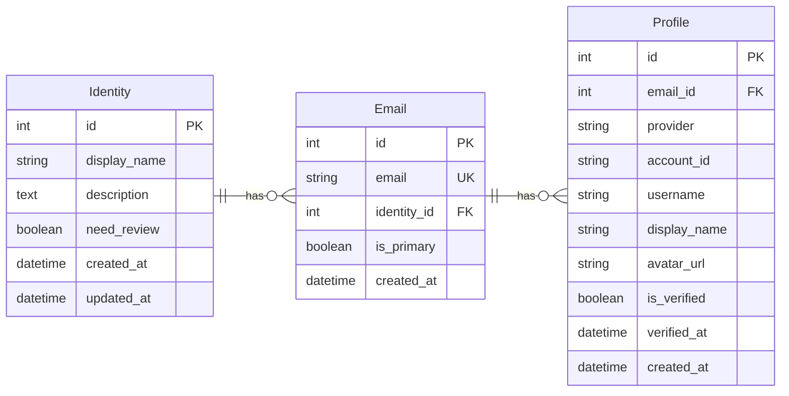
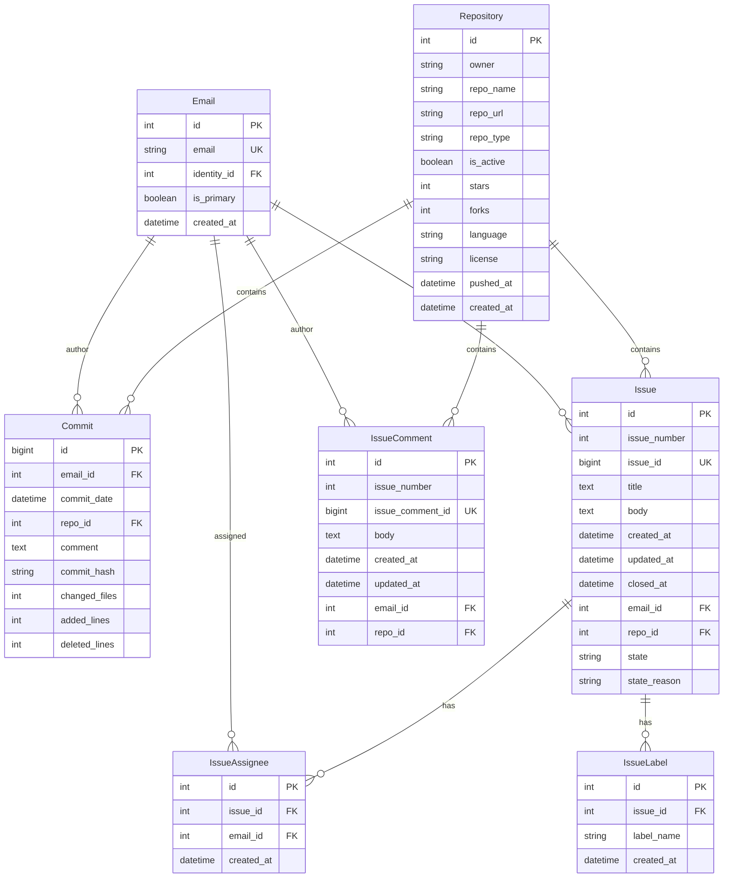
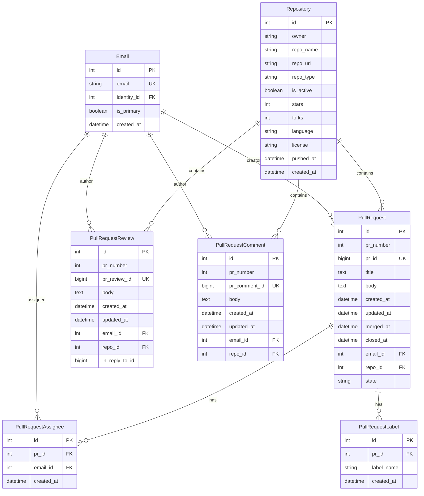
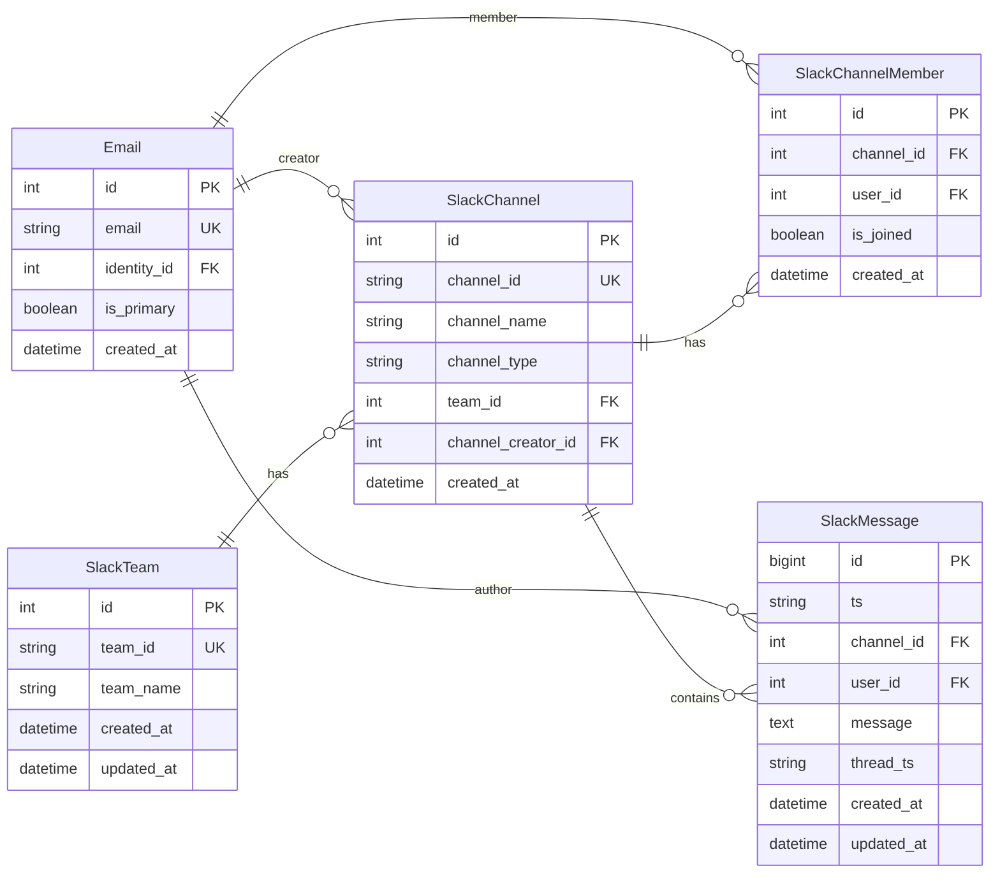
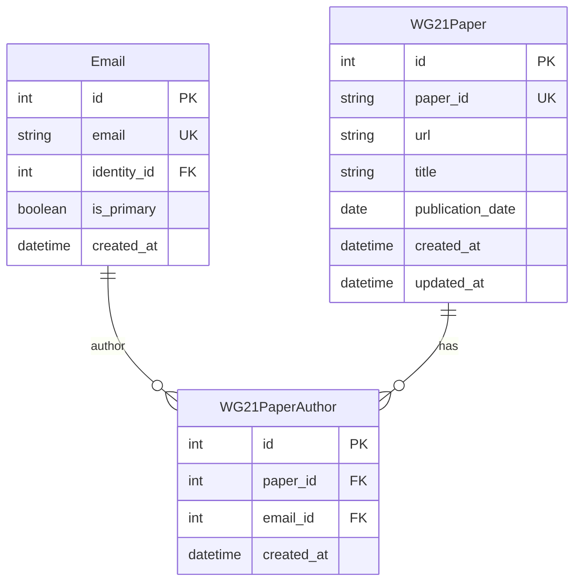

# Database Schema Documentation

This document describes the database schema for the BoostDataCollector project.

## Entity Relationship Diagrams

### Part 1: Core Identity Schema (Identity, Email, Profile)

### Part 2a: GitHub Schema - Commits and Issues

### Part 2b: GitHub Schema - Pull Requests

### Part 3: Slack Schema with Email

### Part 4: WG21 Papers Schema

## Table Descriptions

### Core Identity Tables

#### `identity`

Represents a contributor identity that groups multiple email addresses belonging to the same person. Used for identity resolution across different platforms.

**Key Fields:**

- `display_name`: Human-readable name for the identity
- `need_review`: Flag indicating if the identity needs manual review
- `description`: Additional notes about the identity

#### `email`

Stores email addresses linked to identities. Acts as the central linking table connecting contributors to their activities across GitHub and Slack.

**Key Fields:**

- `email`: Unique email address (unique constraint)
- `identity_id`: Links to the parent identity
- `is_primary`: Indicates if this is the primary email for the identity

#### `profile`

Stores user profiles from external providers (GitHub, Slack, etc.) linked to email addresses. Contains provider-specific account information.

**Key Fields:**

- `provider`: Source platform (e.g., "github", "slack")
- `account_id`: Provider-specific account identifier
- `username`: Username on the provider platform
- `is_verified`: Whether the profile has been verified

### GitHub Tables

#### `github_repo`

Stores Git repository information from GitHub. Tracks repositories being monitored for activity.

**Key Fields:**

- `owner`: Repository owner (username or organization)
- `repo_name`: Repository name
- `repo_url`: Full repository URL
- `repo_type`: Type/category of repository
- `is_active`: Whether the repository is actively being monitored
- `stars`: Number of stars the repository has received
- `forks`: Number of forks of the repository
- `language`: Primary programming language of the repository
- `license`: License type of the repository (e.g., "MIT", "Apache-2.0", "GPL-3.0")
- `pushed_at`: Timestamp of the last push to the repository

#### `github_commit`

Stores Git commit information including commit metadata and statistics.

**Key Fields:**

- `commit_hash`: Unique commit hash (unique per repository)
- `commit_date`: When the commit was made
- `comment`: Commit message
- `changed_files`: Number of files changed
- `added_lines`: Lines added in the commit
- `deleted_lines`: Lines deleted in the commit

#### `github_issue`

Stores GitHub issue information including title, body, and state.

**Key Fields:**

- `issue_number`: Issue number within the repository
- `issue_id`: Unique GitHub issue ID
- `state`: Issue state (open, closed, etc.)
- `state_reason`: Reason for the current state (completed, closed, etc)

#### `github_issue_comment`

Stores comments made on GitHub issues.

**Key Fields:**

- `issue_number`: Associated issue number
- `issue_comment_id`: Unique GitHub comment ID
- `body`: Comment content

#### `github_issue_assignee`

Junction table establishing the many-to-many relationship between GitHub issues and their assignees. One issue can have multiple assignees, and one email (person) can be assigned to multiple issues.

**Key Fields:**

- `issue_id`: Foreign key linking to the Issue table
- `email_id`: Foreign key linking to the Email table (identifies the assignee)

**Note:** A composite unique constraint should be applied on (`issue_id`, `email_id`) to prevent duplicate assignee-issue combinations.

#### `github_issue_label`

Junction table establishing the many-to-many relationship between GitHub issues and labels. One issue can have multiple labels, and one label name can be applied to multiple issues.

**Key Fields:**

- `issue_id`: Foreign key linking to the Issue table
- `label_name`: Name of the label (e.g., "bug", "enhancement", "documentation")

**Note:** A composite unique constraint should be applied on (`issue_id`, `label_name`) to prevent duplicate label-issue combinations.

#### `github_pull_request`

Stores GitHub pull request information including merge and close timestamps.

**Key Fields:**

- `pr_number`: Pull request number within the repository
- `pr_id`: Unique GitHub PR ID
- `state`: PR state (open, closed, merged)
- `merged_at`: When the PR was merged (if applicable)
- `closed_at`: When the PR was closed

#### `github_pull_request_review`

Stores review comments and approvals on pull requests.

**Key Fields:**

- `pr_number`: Associated pull request number
- `pr_review_id`: Unique GitHub review ID
- `in_reply_to_id`: ID of the review being replied to (for threaded reviews)

#### `github_pull_request_comment`

Stores comments on pull requests (non-review comments).

**Key Fields:**

- `pr_number`: Associated pull request number
- `pr_comment_id`: Unique GitHub comment ID
- `body`: Comment content

#### `github_pull_request_assignee`

Junction table establishing the many-to-many relationship between GitHub pull requests and their assignees. One pull request can have multiple assignees, and one email (person) can be assigned to multiple pull requests. Note that the creator of a PR (stored in `github_pull_request.email_id`) is separate from assignees.

**Key Fields:**

- `pr_id`: Foreign key linking to the PullRequest table
- `email_id`: Foreign key linking to the Email table (identifies the assignee)

**Note:** A composite unique constraint should be applied on (`pr_id`, `email_id`) to prevent duplicate assignee-PR combinations.

#### `github_pull_request_label`

Junction table establishing the many-to-many relationship between GitHub pull requests and labels. One pull request can have multiple labels, and one label name can be applied to multiple pull requests.

**Key Fields:**

- `pr_id`: Foreign key linking to the PullRequest table
- `label_name`: Name of the label (e.g., "bug", "enhancement", "documentation")

**Note:** A composite unique constraint should be applied on (`pr_id`, `label_name`) to prevent duplicate label-PR combinations.

### Slack Tables

#### `slack_team`

Stores Slack workspace/team information.

**Key Fields:**

- `team_id`: Unique Slack team ID
- `team_name`: Name of the Slack team/workspace

#### `slack_channel`

Stores Slack channel information including channel type and creator.

**Key Fields:**

- `channel_id`: Unique Slack channel ID
- `channel_name`: Name of the channel
- `channel_type`: Type of channel (public, private, etc.)
- `channel_creator_id`: Email ID of the channel creator

#### `slack_channel_member`

Junction table linking channels to their members.

**Key Fields:**

- `channel_id`: Associated channel
- `user_id`: Email ID of the member
- `is_joined`: Whether the user is currently a member

#### `slack_message`

Stores Slack messages including thread information.

**Key Fields:**

- `ts`: Slack timestamp identifier
- `message`: Message content
- `thread_ts`: Timestamp of parent message (if this is a thread reply)
- `created_at`: When the message was sent
- `updated_at`: When the message was last edited

### WG21 Papers Tables

#### `wg21_paper`

Stores metadata for WG21 (C++ Standards Committee) papers. Papers can have multiple authors, which are tracked through the `wg21_paper_author` junction table.

**Key Fields:**

- `paper_id`: Unique identifier for the WG21 paper (e.g., "p1234r5", "n4567")
- `url`: Full URL to the paper document
- `title`: Paper title
- `publication_date`: Date when the paper was published/submitted

#### `wg21_paper_author`

Junction table establishing the many-to-many relationship between WG21 papers and their authors. One paper can have multiple authors, and one author can write multiple papers.

**Key Fields:**

- `paper_id`: Foreign key linking to the WG21Paper table
- `email_id`: Foreign key linking to the Email table (identifies the author)

**Note:** A composite unique constraint should be applied on (`paper_id`, `email_id`) to prevent duplicate author-paper combinations.

## Relationships Summary

- **Identity -> Email**: One-to-many (one identity can have multiple emails)
- **Email -> Profile**: One-to-many (one email can have profiles on multiple platforms)
- **Email -> All Activity Tables**: One-to-many (one email can have many commits, issues, PRs, messages, etc.)
- **Email <-> WG21Paper**: Many-to-many (through WG21PaperAuthor - one email can author multiple papers, one paper can have multiple authors)
- **Email <-> Issue**: Many-to-many (through IssueAssignee - one email can be assigned to multiple issues, one issue can have multiple assignees)
- **Email <-> PullRequest**: Many-to-many (through PullRequestAssignee - one email can be assigned to multiple PRs, one PR can have multiple assignees. Note: PR creator is separate from assignees)
- **Issue <-> Label**: Many-to-many (through IssueLabel - one issue can have multiple labels, one label name can be applied to multiple issues)
- **PullRequest <-> Label**: Many-to-many (through PullRequestLabel - one PR can have multiple labels, one label name can be applied to multiple PRs)
- **Repository -> All GitHub Activity Tables**: One-to-many (one repo contains many commits, issues, PRs, etc.)
- **SlackTeam -> SlackChannel**: One-to-many (one team has many channels)
- **SlackChannel -> SlackChannelMember**: One-to-many (one channel has many members)
- **SlackChannel -> SlackMessage**: One-to-many (one channel contains many messages)

## Notes

- All tables use integer primary keys with auto-increment except `Commit` and `SlackMessage` which use `BigInteger`
- Foreign keys use `ondelete='SET NULL'` to preserve data integrity when referenced records are deleted
- Most tables include `created_at` and `updated_at` timestamps for audit purposes
- Email addresses serve as the central linking mechanism between identities and their activities across platforms
- WG21 papers use a many-to-many relationship with authors through the `wg21_paper_author` junction table, allowing papers to have multiple authors and authors to write multiple papers
- The `wg21_paper_author` table requires a composite unique constraint on (`paper_id`, `email_id`) to prevent duplicate author-paper combinations
- The `github_issue_assignee` table requires a composite unique constraint on (`issue_id`, `email_id`) to prevent duplicate assignee-issue combinations
- The `github_pull_request_assignee` table requires a composite unique constraint on (`pr_id`, `email_id`) to prevent duplicate assignee-PR combinations
- The `github_issue_label` table requires a composite unique constraint on (`issue_id`, `label_name`) to prevent duplicate label-issue combinations
- The `github_pull_request_label` table requires a composite unique constraint on (`pr_id`, `label_name`) to prevent duplicate label-PR combinations
