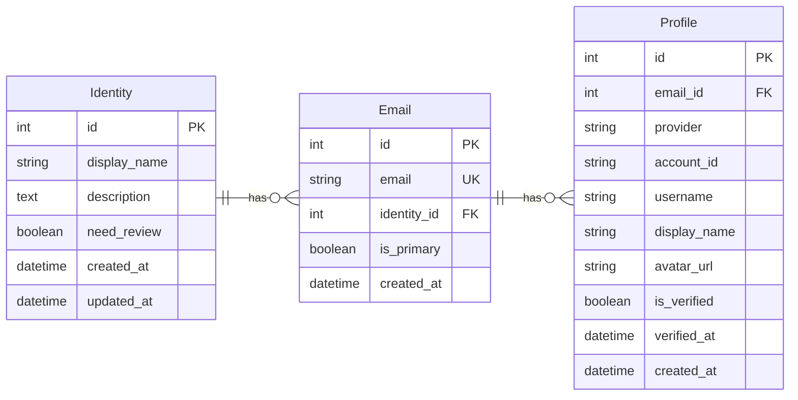
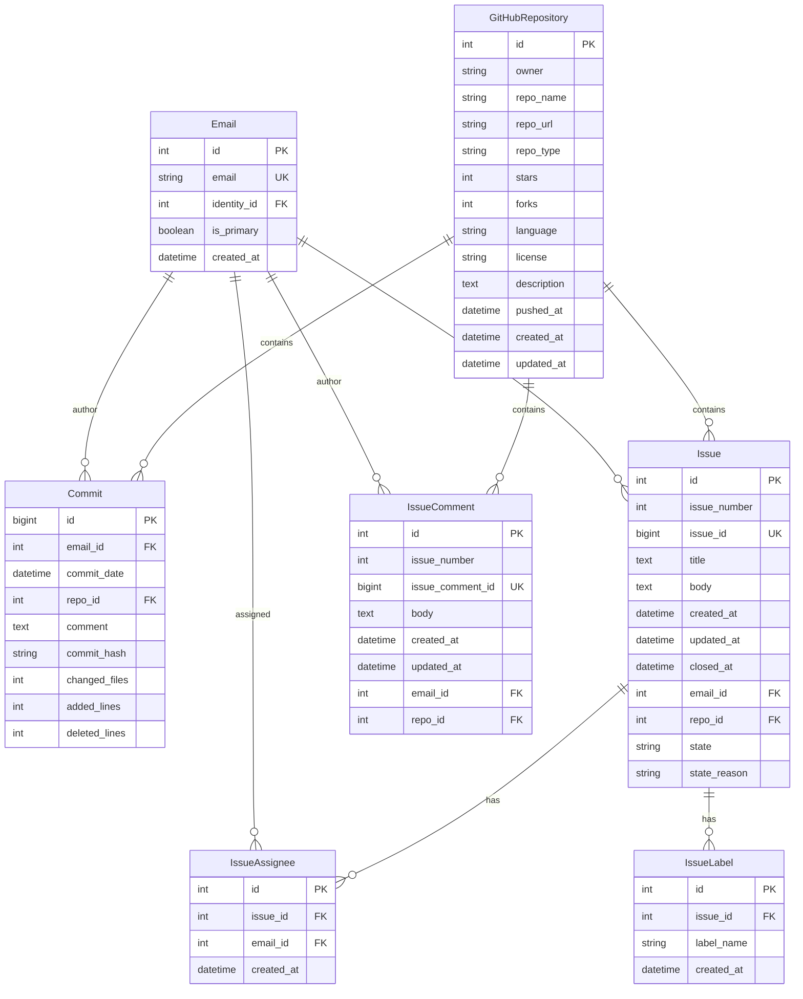
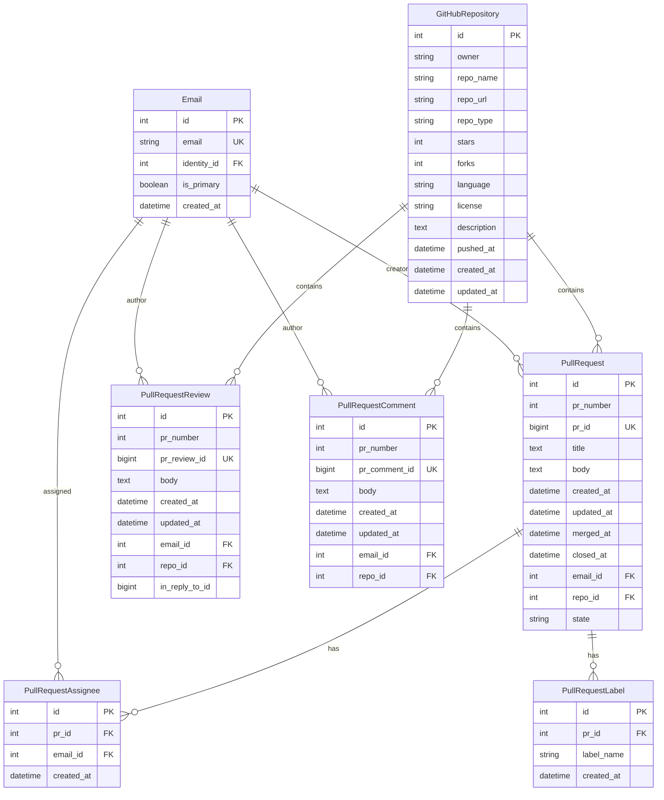
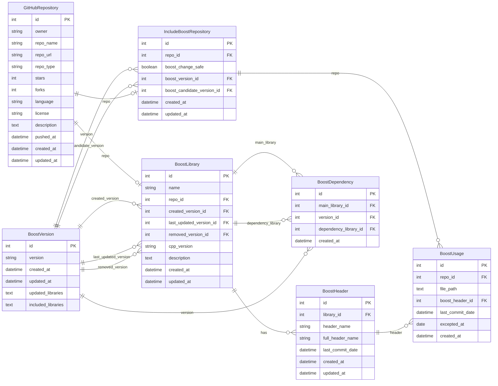
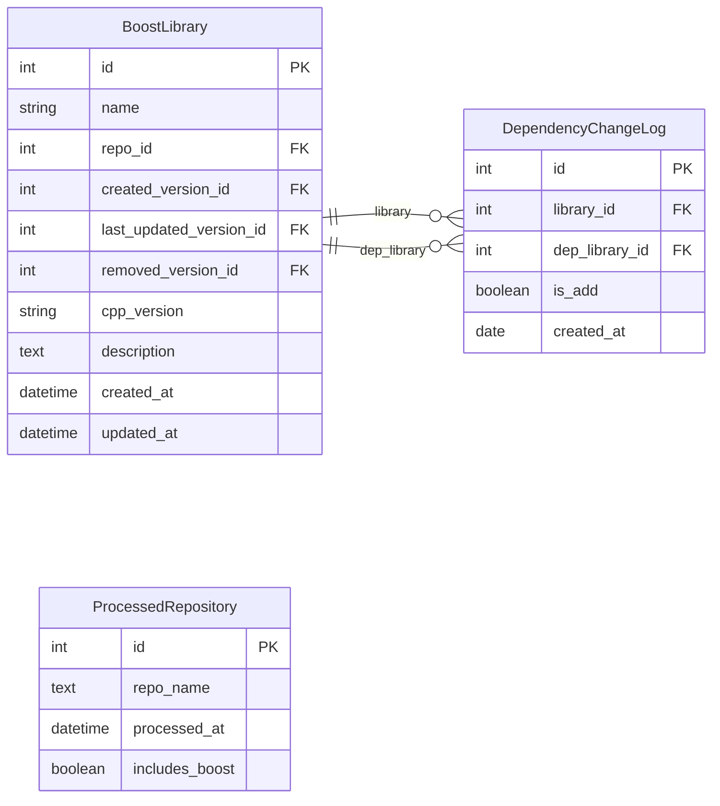
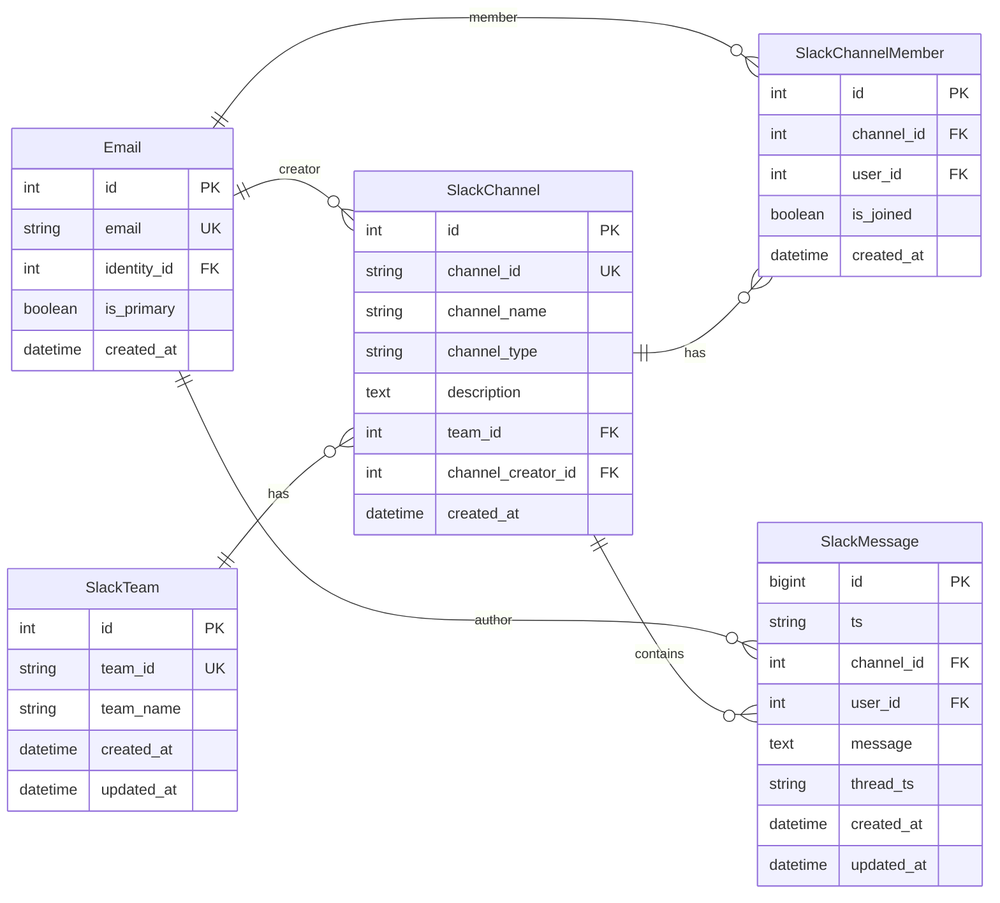
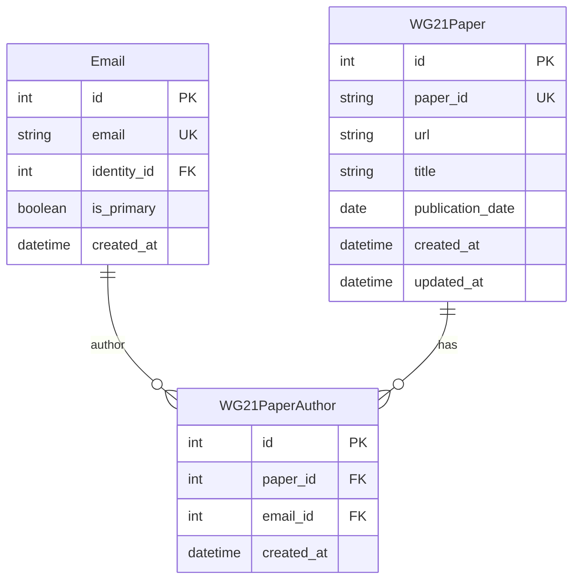
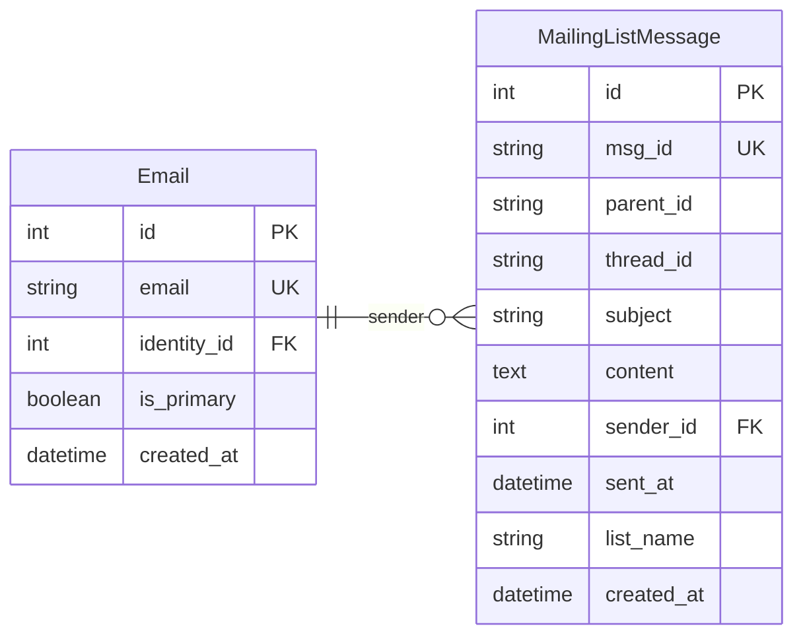
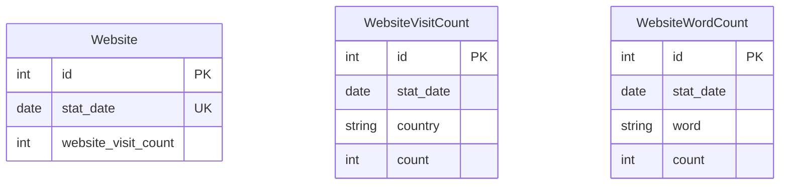
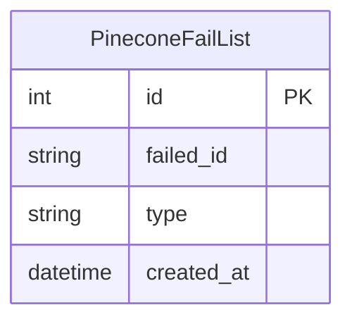

# Database Schema Documentation

This document describes the database schema for the Boost Dashboard.

## Dashboard Data Requirements

- Track Boost library repositories, commits, issues, and pull requests with their key metrics and activities.

- Monitor Boost libraries, headers, versions, dependencies, and usage tracking across repositories.

- Track library dependency changes (addition/removal history) and processed repositories (processing status, Boost inclusion tracking).

- Monitor Slack activity (cpplang channel activity, team/channel information, message counts) and mailing lists (message counts, thread tracking, mailing list types).

- Resolve contributor profiles across platforms (email addresses, GitHub/Slack profiles) and track WG21 papers (authors and publications).

- Track website statistics (daily visit counts, visits by country, search word frequency and counts).

## Executive Summary

This database schema supports the Boost Dashboard. It tracks and analyzes Boost library development, community engagement, and ecosystem health. The schema has eight main parts:

**Part 1: Core Identity Schema** - Creates a unified identity system. It links contributors across GitHub, Slack, and mailing lists using email addresses and profiles. This allows tracking contributors across all platforms.

**Part 2: GitHub Schema** - Captures GitHub activity data. It includes commits, issues, pull requests, labels, and assignees for Boost library repositories. It tracks metrics like lines added or removed, issue states, PR reviews, and repository information such as stars, forks, language, and license.

**Part 3: Boost Library Schema** - Manages Boost library information. It stores library details, header files, version history, and dependencies between libraries. It also tracks how Boost libraries are used in external repositories. This enables tracking of library changes, version releases, and adoption patterns.

**Part 4: Slack Schema** - Tracks communication in Slack workspaces. It includes teams, channels, channel members, and messages. It supports thread tracking for conversations.

**Part 5: WG21 Papers Schema** - Records C++ Standards Committee papers and their authors. It links papers to contributor identities.

**Part 6: Mailing List Schema** - Captures mailing list messages with thread tracking. This enables analysis of community discussions and communication patterns.

**Part 7: Web Search Schema** - Stores website analytics. It includes daily visit counts, visits by country, and search word frequency statistics.

**Part 8: Pinecone Fail List Schema** - Tracks failed Pinecone operations. It records items that failed to be processed or indexed in the Pinecone vector database, categorized by type (mailing list, WG21 paper, Slack, etc.).

The schema uses email addresses as the central linking mechanism. This allows contributors to be tracked across all platforms. Data integrity is maintained through foreign key relationships and unique constraints. Most tables include timestamps (`created_at`, `updated_at`) to track when data changes.

## Entity Relationship Diagrams

### Part 1: Core Identity Schema (Identity, Email, Profile)

### Part 2a: GitHub Schema - Commits and Issues

### Part 2b: GitHub Schema - Pull Requests

### Part 3a: Boost Library Schema

### Part 3b: Boost Library Schema - Other

### Part 4: Slack Schema

### Part 5: WG21 Papers Schema

### Part 6: Mailing List Schema

### Part 7: Web Search Schema

### Part 8: Pinecone Fail List Schema

## Table Descriptions

### Core Identity Tables

#### `identity`

Represents a contributor identity that groups multiple email addresses belonging to the same person. Used for identity resolution across different platforms.

**Key Fields:**

- `display_name`: Human-readable name for the identity
- `need_review`: Flag indicating if the identity needs manual review
- `description`: Additional notes about the identity

#### `email`

Stores email addresses linked to identities. Acts as the central linking table connecting contributors to their activities across GitHub and Slack.

**Key Fields:**

- `email`: Unique email address (unique constraint)
- `identity_id`: Links to the parent identity
- `is_primary`: Indicates if this is the primary email for the identity

#### `profile`

Stores user profiles from external providers (GitHub, Slack, etc.) linked to email addresses. Contains provider-specific account information.

**Key Fields:**

- `provider`: Source platform (e.g., "github", "slack")
- `account_id`: Provider-specific account identifier
- `username`: Username on the provider platform
- `is_verified`: Whether the profile has been verified

### GitHub Tables

#### `github_repo`

Stores Boost library information from GitHub. Tracks Boost libraries being monitored for activity.

**Key Fields:**

- `owner`: Repository owner (username or organization)
- `repo_name`: Repository name
- `repo_url`: Full repository URL
- `repo_type`: Type/category of repository
- `stars`: Number of stars the repository has received
- `forks`: Number of forks of the repository
- `language`: Primary programming language of the repository
- `license`: License type of the repository (e.g., "MIT", "Apache-2.0", "GPL-3.0")
- `description`: Repository description/topic
- `pushed_at`: Timestamp of the last push to the repository

#### `github_commit`

Stores Git commit information including commit metadata and statistics.

**Key Fields:**

- `commit_hash`: Unique commit hash (unique per repository)
- `commit_date`: When the commit was made
- `comment`: Commit message
- `changed_files`: Number of files changed
- `added_lines`: Lines added in the commit
- `deleted_lines`: Lines deleted in the commit

#### `github_issue`

Stores GitHub issue information including title, body, and state.

**Key Fields:**

- `issue_number`: Issue number within the repository
- `issue_id`: Unique GitHub issue ID
- `state`: Issue state (open, closed, etc.)
- `state_reason`: Reason for the current state (completed, closed, etc)

#### `github_issue_comment`

Stores comments made on GitHub issues.

**Key Fields:**

- `issue_number`: Associated issue number
- `issue_comment_id`: Unique GitHub comment ID
- `body`: Comment content

#### `github_issue_assignee`

Junction table establishing the many-to-many relationship between GitHub issues and their assignees. One issue can have multiple assignees, and one email (person) can be assigned to multiple issues.

**Key Fields:**

- `issue_id`: Foreign key linking to the Issue table
- `email_id`: Foreign key linking to the Email table (identifies the assignee)

**Note:** A composite unique constraint should be applied on (`issue_id`, `email_id`) to prevent duplicate assignee-issue combinations.

#### `github_issue_label`

Junction table establishing the many-to-many relationship between GitHub issues and labels. One issue can have multiple labels, and one label name can be applied to multiple issues.

**Key Fields:**

- `issue_id`: Foreign key linking to the Issue table
- `label_name`: Name of the label (e.g., "bug", "enhancement", "documentation")

**Note:** A composite unique constraint should be applied on (`issue_id`, `label_name`) to prevent duplicate label-issue combinations.

#### `github_pull_request`

Stores GitHub pull request information including merge and close timestamps.

**Key Fields:**

- `pr_number`: Pull request number within the repository
- `pr_id`: Unique GitHub PR ID
- `state`: PR state (open, closed, merged)
- `merged_at`: When the PR was merged (if applicable)
- `closed_at`: When the PR was closed

#### `github_pull_request_review`

Stores review comments and approvals on pull requests.

**Key Fields:**

- `pr_number`: Associated pull request number
- `pr_review_id`: Unique GitHub review ID
- `in_reply_to_id`: ID of the review being replied to (for threaded reviews)

#### `github_pull_request_comment`

Stores comments on pull requests (non-review comments).

**Key Fields:**

- `pr_number`: Associated pull request number
- `pr_comment_id`: Unique GitHub comment ID
- `body`: Comment content

#### `github_pull_request_assignee`

Junction table establishing the many-to-many relationship between GitHub pull requests and their assignees. One pull request can have multiple assignees, and one email (person) can be assigned to multiple pull requests. Note that the creator of a PR (stored in `github_pull_request.email_id`) is separate from assignees.

**Key Fields:**

- `pr_id`: Foreign key linking to the PullRequest table
- `email_id`: Foreign key linking to the Email table (identifies the assignee)

**Note:** A composite unique constraint should be applied on (`pr_id`, `email_id`) to prevent duplicate assignee-PR combinations.

#### `github_pull_request_label`

Junction table establishing the many-to-many relationship between GitHub pull requests and labels. One pull request can have multiple labels, and one label name can be applied to multiple pull requests.

**Key Fields:**

- `pr_id`: Foreign key linking to the PullRequest table
- `label_name`: Name of the label (e.g., "bug", "enhancement", "documentation")

**Note:** A composite unique constraint should be applied on (`pr_id`, `label_name`) to prevent duplicate label-PR combinations.

#### `dependency_change_log`

Stores dependency change history between Boost libraries. Tracks when one Boost library depends on another Boost library, including when dependencies are added or removed.

**Key Fields:**

- `library_id`: Foreign key linking to the BoostLibrary table (the Boost library that has the dependency)
- `dep_library_id`: Foreign key linking to the BoostLibrary table (the Boost library being depended upon)
- `is_add`: Boolean flag indicating whether this dependency was added (true) or removed (false)
- `created_at`: Date when this dependency relationship was recorded

**Note:** This table tracks the history of dependency changes. A composite unique constraint should be applied on (`library_id`, `dep_library_id`, `created_at`) to prevent duplicate dependency records, or consider using a separate table for current dependencies and this table for dependency history.

#### `processed_repository`

Stores processing status of repositories. Used for tracking which repositories have been processed and whether they include Boost.

**Key Fields:**

- `repo_name`: Repository name (text)
- `processed_at`: Timestamp when the repository was processed
- `includes_boost`: Boolean flag indicating if the repository includes Boost

**Note:** This table is used only for recording processing status and does not have any foreign key relationships.

### Boost Library Tables

#### `boost_library`

Stores Boost library information. Each Boost library is linked to a GitHub repository and tracks version information.

**Key Fields:**

- `name`: Boost library name
- `repo_id`: Foreign key linking to the GitHubRepository table
- `created_version_id`: Foreign key linking to the BoostVersion table (version when the library was first created)
- `last_updated_version_id`: Foreign key linking to the BoostVersion table (last version when the library was updated)
- `removed_version_id`: Foreign key linking to the BoostVersion table (version when the library was removed, if applicable)
- `cpp_version`: C++ version requirement for the library
- `description`: Library description
- `repo_type`: Type of repository (should be 'boost-library')

#### `boost_header`

Stores header file information for Boost libraries. Each header belongs to a Boost library.

**Key Fields:**

- `library_id`: Foreign key linking to the BoostLibrary table
- `header_name`: Short header name (e.g., "algorithm")
- `full_header_name`: Full header path (e.g., "boost/algorithm/string.hpp")
- `last_commit_date`: Timestamp of the last commit that modified this header

#### `boost_version`

Stores Boost release version information. Tracks which libraries were updated or included in each version.

**Key Fields:**

- `version`: Boost version string (e.g., "1.84.0")
- `updated_libraries`: Text field listing libraries updated in this version
- `included_libraries`: Text field listing libraries included in this version

#### `boost_dependency`

Stores dependency relationships between Boost libraries for specific versions. Tracks which libraries depend on other libraries in each Boost version.

**Key Fields:**

- `main_library_id`: Foreign key linking to the BoostLibrary table (the library that has the dependency)
- `version_id`: Foreign key linking to the BoostVersion table
- `dependency_library_id`: Foreign key linking to the BoostLibrary table (the library being depended upon)

**Note:** A composite unique constraint should be applied on (`main_library_id`, `version_id`, `dependency_library_id`) to prevent duplicate dependency records.

#### `include_boost_repository`

Stores information about repositories that include/use Boost libraries. Links external repositories to Boost versions they use.

**Key Fields:**

- `repo_id`: Foreign key linking to the GitHubRepository table
- `boost_change_safe`: Boolean flag indicating if the repository is safe from Boost changes
- `boost_version_id`: Foreign key linking to the BoostVersion table (current Boost version used)
- `boost_candidate_version_id`: Foreign key linking to the BoostVersion table (candidate Boost version)
- `repo_type`: Type of repository (should be 'include boost repository')

#### `boost_usage`

Stores usage information of Boost headers in external repositories. Tracks which Boost headers are used in which files.

**Key Fields:**

- `repo_id`: Foreign key linking to the IncludeBoostRepository table
- `file_path`: Path to the file using the Boost header
- `boost_header_id`: Foreign key linking to the BoostHeader table
- `last_commit_date`: Timestamp of the last commit that modified this usage
- `excepted_at`: Date when this usage was excepted/excluded from tracking

### Slack Tables

#### `slack_team`

Stores Slack workspace/team information.

**Key Fields:**

- `team_id`: Unique Slack team ID
- `team_name`: Name of the Slack team/workspace

#### `slack_channel`

Stores Slack channel information including channel type and creator.

**Key Fields:**

- `channel_id`: Unique Slack channel ID
- `channel_name`: Name of the channel
- `channel_type`: Type of channel (public, private, etc.)
- `description`: Channel description/topic
- `channel_creator_id`: Email ID of the channel creator

#### `slack_channel_member`

Junction table linking channels to their members.

**Key Fields:**

- `channel_id`: Associated channel
- `user_id`: Email ID of the member
- `is_joined`: Whether the user is currently a member

#### `slack_message`

Stores Slack messages including thread information.

**Key Fields:**

- `ts`: Slack timestamp identifier
- `message`: Message content
- `thread_ts`: Timestamp of parent message (if this is a thread reply)
- `created_at`: When the message was sent
- `updated_at`: When the message was last edited

### WG21 Papers Tables

#### `wg21_paper`

Stores metadata for WG21 (C++ Standards Committee) papers. Papers can have multiple authors, which are tracked through the `wg21_paper_author` junction table.

**Key Fields:**

- `paper_id`: Unique identifier for the WG21 paper (e.g., "p1234r5", "n4567")
- `url`: Full URL to the paper document
- `title`: Paper title
- `publication_date`: Date when the paper was published/submitted

#### `wg21_paper_author`

Junction table establishing the many-to-many relationship between WG21 papers and their authors. One paper can have multiple authors, and one author can write multiple papers.

**Key Fields:**

- `paper_id`: Foreign key linking to the WG21Paper table
- `email_id`: Foreign key linking to the Email table (identifies the author)

**Note:** A composite unique constraint should be applied on (`paper_id`, `email_id`) to prevent duplicate author-paper combinations.

### Mailing List Tables

#### `mailing_list_message`

Stores messages from mailing lists (e.g., Boost mailing lists). Tracks email threads, parent-child relationships, and message metadata.

**Key Fields:**

- `msg_id`: Unique message identifier (unique constraint)
- `parent_id`: Message ID of the parent message (string, stores the `msg_id` of the parent message for threaded conversations)
- `thread_id`: Thread identifier to group related messages together
- `subject`: Message subject line
- `content`: Message body/content
- `sender_id`: Foreign key linking to the Email table (identifies the sender)
- `sent_at`: Timestamp when the message was sent
- `list_name`: Name of the mailing list (e.g., "boost@lists.boost.org")

**Note:** The `parent_id` field stores the `msg_id` of the parent message as a string reference to track message threads. A unique constraint should be applied on `msg_id` to prevent duplicate messages.

### Web Search Tables

#### `website`

Stores overall website visit statistics aggregated by date.

**Key Fields:**

- `stat_date`: Statistics date (unique constraint) - represents a single day
- `website_visit_count`: Total number of website visits on this date

**Note:** A unique constraint should be applied on `stat_date` to ensure one record per day.

#### `website_visit_count`

Stores website visit statistics broken down by country and date.

**Key Fields:**

- `stat_date`: Statistics date - represents a single day
- `country`: Country code or name
- `count`: Number of visits from this country on this date

**Note:** A composite unique constraint should be applied on (`stat_date`, `country`) to prevent duplicate records.

#### `website_word_count`

Stores search word frequency statistics by date.

**Key Fields:**

- `stat_date`: Statistics date - represents a single day
- `word`: Search word or keyword
- `count`: Number of times this word was searched on this date

**Note:** A composite unique constraint should be applied on (`stat_date`, `word`) to prevent duplicate records.

### Pinecone Fail List Tables

#### `pinecone_fail_list`

Stores records of failed Pinecone operations. Tracks items that failed to be processed or indexed in Pinecone vector database.

**Key Fields:**

- `failed_id`: Unique identifier of the failed item (unique constraint) - the ID of the item that failed (e.g., message ID, paper ID, Slack message ID)
- `type`: Type of the failed item (e.g., "mailing list", "wg21 paper", "slack", etc.)

**Note:** A unique constraint should be applied on `failed_id` to prevent duplicate failure records. The `type` field categorizes the source of the failed item for easier tracking and debugging.

## Relationships Summary

- **Identity -> Email**: One-to-many (one identity can have multiple emails)
- **Email -> Profile**: One-to-many (one email can have profiles on multiple platforms)
- **Email -> All Activity Tables**: One-to-many (one email can have many commits, issues, PRs, messages, etc.)
- **Email -> MailingListMessage**: One-to-many (one email can send multiple mailing list messages)
- **Email <-> WG21Paper**: Many-to-many (through WG21PaperAuthor - one email can author multiple papers, one paper can have multiple authors)
- **Email <-> Issue**: Many-to-many (through IssueAssignee - one email can be assigned to multiple issues, one issue can have multiple assignees)
- **Email <-> PullRequest**: Many-to-many (through PullRequestAssignee - one email can be assigned to multiple PRs, one PR can have multiple assignees. Note: PR creator is separate from assignees)
- **Issue <-> Label**: Many-to-many (through IssueLabel - one issue can have multiple labels, one label name can be applied to multiple issues)
- **PullRequest <-> Label**: Many-to-many (through PullRequestLabel - one PR can have multiple labels, one label name can be applied to multiple PRs)
- **GitHubRepository -> All GitHub Activity Tables**: One-to-many (one repository contains many commits, issues, PRs, etc.)
- **BoostLibrary <-> BoostLibrary**: Many-to-many (through DependencyChangeLog - one Boost library can depend on multiple Boost libraries, one Boost library can be depended upon by multiple Boost libraries)
- **GitHubRepository -> BoostLibrary**: One-to-one (one repository can be one Boost library)
- **BoostLibrary -> BoostHeader**: One-to-many (one Boost library has many headers)
- **BoostVersion -> BoostLibrary**: One-to-many (created_version_id - one version can be the creation version for multiple libraries)
- **BoostVersion -> BoostLibrary**: One-to-many (last_updated_version_id - one version can be the last update version for multiple libraries)
- **BoostVersion -> BoostLibrary**: One-to-many (removed_version_id - one version can be the removal version for multiple libraries)
- **BoostLibrary <-> BoostLibrary**: Many-to-many (through BoostDependency - one library can depend on multiple libraries, one library can be depended upon by multiple libraries, per version)
- **BoostVersion -> BoostDependency**: One-to-many (one Boost version has many dependency relationships)
- **BoostVersion -> IncludeBoostRepository**: One-to-many (one Boost version can be used by multiple repositories)
- **GitHubRepository -> IncludeBoostRepository**: One-to-one (one repository can be one include Boost repository)
- **IncludeBoostRepository -> BoostUsage**: One-to-many (one include Boost repository has many Boost header usages)
- **BoostHeader -> BoostUsage**: One-to-many (one Boost header can be used in multiple files/repositories)
- **SlackTeam -> SlackChannel**: One-to-many (one team has many channels)
- **SlackChannel -> SlackChannelMember**: One-to-many (one channel has many members)
- **SlackChannel -> SlackMessage**: One-to-many (one channel contains many messages)

## Notes

- All tables use integer primary keys with auto-increment except `Commit` and `SlackMessage` which use `BigInteger`
- Foreign keys use `ondelete='SET NULL'` to preserve data integrity when referenced records are deleted
- Most tables include `created_at` and `updated_at` timestamps for audit purposes
- Email addresses serve as the central linking mechanism between identities and their activities across platforms
- WG21 papers use a many-to-many relationship with authors through the `wg21_paper_author` junction table, allowing papers to have multiple authors and authors to write multiple papers
- The `wg21_paper_author` table requires a composite unique constraint on (`paper_id`, `email_id`) to prevent duplicate author-paper combinations
- The `github_issue_assignee` table requires a composite unique constraint on (`issue_id`, `email_id`) to prevent duplicate assignee-issue combinations
- The `github_pull_request_assignee` table requires a composite unique constraint on (`pr_id`, `email_id`) to prevent duplicate assignee-PR combinations
- The `github_issue_label` table requires a composite unique constraint on (`issue_id`, `label_name`) to prevent duplicate label-issue combinations
- The `github_pull_request_label` table requires a composite unique constraint on (`pr_id`, `label_name`) to prevent duplicate label-PR combinations
- The `boost_dependency` table requires a composite unique constraint on (`main_library_id`, `version_id`, `dependency_library_id`) to prevent duplicate dependency records
- The `boost_library` table should have `repo_type` set to 'boost-library'
- The `include_boost_repository` table should have `repo_type` set to 'include boost repository'
- The `processed_repository` table is used only for tracking processing status and has no foreign key relationships
